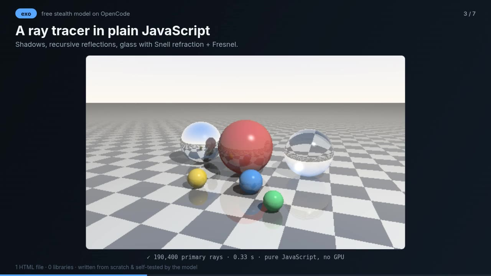

# Yetenek Vitrini — 7 demos, 1 HTML file, 0 libraries

**▶ Live demo:** https://alicerven.github.io/exo-skill-test/



A capability showcase built in a single session with **exo**, the free stealth model on [OpenCode](https://opencode.ai).
Every demo was written from scratch **and run & tested by the model itself** before delivery.
No frameworks, no npm, no CDN: open `index.html` and it works offline.

| # | Demo | What's inside |
|---|------|---------------|
| 1 | **Minik**, a programming language | Lexer → recursive-descent parser → AST → bytecode compiler → stack VM. Functions, recursion, arrays, line-numbered errors, infinite-loop guard. |
| 2 | **2D physics engine** | Semi-implicit Euler, sub-stepping, impulse-based circle–circle & circle–segment collisions, restitution, mouse spring. |
| 3 | **Ray tracer** | Ray–sphere/plane intersection, Phong shading, shadow rays, recursive reflections, glass with Snell refraction + Schlick Fresnel, 4× AA. Pure JS, no GPU. |
| 4 | **Math, verified** | Exact large-angle pendulum period via the complete elliptic integral (computed with AGM), independently cross-checked with an RK4 simulation (relative diff ~1e-13). |
| 5 | **Fener Bekçisi** (game) | Playable story game: quest chain, Turkish voiced dialogue, enemies with an FSM (patrol → chase → search → return), line of sight and BFS pathfinding. |
| 6 | **Agent team** | Planner → parallel Web Worker agents (segmented sieve) → independent reviewer (Miller–Rabin + random sampling) → merger. One worker is deliberately faulty: it gets caught, quarantined and replaced. Result checked against known π(N). |
| 7 | **Neural net in the browser** | Turkish sentiment classifier: hashed word/bigram/char-trigram features, 2048→16→1 MLP, hand-written backprop, train/test split, live loss curve, per-word explanations. |

### Honest notes
- The agents in demo 6 are deterministic programs, not LLMs. The demo shows the *coordination pattern*.
- Demo 7 uses a deliberately tiny dataset (112 sentences, ~73% test accuracy). On its first run it scored **29%**: the model diagnosed mirrored train/test sentences, fixed the dataset, and got it to 73%.
- Voiceover is AI-generated locally with [EMA Lightning](https://huggingface.co/canberkkkkkk/ema-lightning) (offline Turkish TTS).
- It was built over several turns of conversation, not a single prompt.

## Run locally
Just open `index.html`. Or serve it:
```bash
python3 -m http.server 8000   # → http://localhost:8000
```

## Project layout
```
index.html          all 7 demos (HTML + CSS + JS, single file)
ses/                Turkish voice clips (MP3) + manifest
ses_uret.py         regenerates the voice clips with EMA Lightning
video/yonetmen.js   "director" that auto-plays the demos and records the promo video (index.html?kayit=1)
video/sunucu.py     local server that receives the recording
docs/               README images
```

### Re-recording the promo video
```bash
python3 video/sunucu.py            # → open http://localhost:8765/index.html?kayit=1 and press "Kaydı başlat"
ffmpeg -i video/kayit.webm -vf "fps=30,format=yuv420p" -c:v libx264 -crf 18 -c:a aac -b:a 160k -movflags +faststart video/exo-vitrin.mp4
```

---

## Türkçe
Tek oturumda **exo** modeliyle (OpenCode üzerinde ücretsiz) geliştirilmiş 7 demoluk yetenek vitrini. Hepsi sıfırdan yazıldı ve model tarafından çalıştırılıp test edildi. Harici kütüphane yoktur, internet bağlantısı gerektirmez: `index.html` dosyasını açman yeterli.

Seslendirmeler yapay zekâ ile üretilmiştir (EMA Lightning, yerel ve çevrimdışı).

## License
MIT
